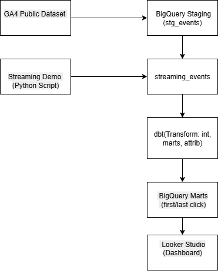

# Real-time Attribution Dashboard

## 📌 Overview
This project implements a **near real-time attribution pipeline and dashboard** that computes **First-Click** and **Last-Click** attribution using:
- GA4 Public Dataset (BigQuery)
- dbt (staging → intermediate → marts → attribution models)
- Python streaming demo (batch inserts into BigQuery)
- Looker Studio Dashboard

The assignment simulates how real-world attribution modeling is built for marketing analytics.

---

## 🏗️ Architecture


**Flow:**
1. GA4 Public Dataset → BigQuery Staging (via dbt)
2. dbt builds intermediate and mart models:
   - `int_user_journey`
   - `mart_first_click`
   - `mart_last_click`
3. Python script simulates real-time events → inserts into `streaming_events` table
4. Looker Studio dashboard visualizes:
   - First vs Last totals
   - 14-day trend
   - Channel breakdown
   - Live streaming events

---

## ⚙️ Setup Instructions

### 1. Clone Repo
```bash
git clone https://github.com/sneha226/attribution_project.git
cd attribution_project

3. dbt Setup

Ensure dbt is installed (dbt --version).

Configure your profiles.yml with your GCP project ID and dataset.

4. Run dbt Models
dbt run
dbt test

5. Run Streaming Demo

Generate synthetic events:
python scripts/generate_events_csv.py


Stream them into BigQuery:
python scripts/generate_events_csv.py


📂 Project Structure
attribution_project/
├── models/
│   ├── staging/
│   │   ├── stg_events.sql
│   │   └── schema.yml
│   ├── intermediate/
│   │   └── int_user_journey.sql
│   └── marts/
│       ├── mart_first_click.sql
│       ├── mart_last_click.sql
│       └── schema.yml
├── scripts/
│   ├── generate_events_csv.py
│   ├── stream_events.py
│   ├── batch_0.csv, batch_1.csv, batch_2.csv
│   └── events.csv
├── architecture.png
├── README.md
└── worklog.md

📊 Dashboard

The Looker Studio dashboard includes:

First vs Last Click Attribution (totals)

14-Day Time Series (purchases over time)

Traffic Source Breakdown (bar chart)

Live Streaming Events Panel

🔗 Dashboard Link: [https://lookerstudio.google.com/reporting/3d3f4de1-fe7c-4a7d-8c67-2c858ea30849]


🚨 Sandbox Limitation

Since this project uses BigQuery Sandbox (Free Tier):

Streaming inserts are not allowed.

I simulated near-real-time ingestion by batching small CSV event files (batch_0.csv, batch_1.csv, batch_2.csv) into BigQuery.

⚡ In a billing-enabled project, the same Python script would use BigQuery’s insert_rows_json API for live streaming.

📒 Runbook
Failure Handling

dbt: rerun dbt run if a job fails; logs are available in target/ folder.

Streaming: rerun batch inserts; idempotency ensured by using unique event IDs.

Monitoring

Use BigQuery audit logs for job monitoring.

Add Slack/Email alerts for streaming failures in production.

Cost Notes

Free Tier (Sandbox) used → no billing.

In production: costs mainly from BigQuery storage, query processing, and streaming inserts.


